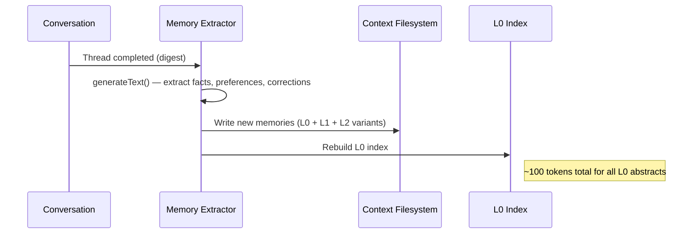

The Context Engine is NIOM's persistent intelligence layer. It stores, organizes, and retrieves everything NIOM learns about you — preferences, facts, corrections, project context, and usage patterns.

## Design philosophy: context as a filesystem

Inspired by [OpenViking](https://github.com/volcengine/openviking) (ByteDance's context database for AI agents), NIOM organizes all context under a **hierarchical filesystem**:

```
~/.niom/context/
├── user/                           # User identity & preferences
│   ├── brain.json                  # Core identity: name, timezone, style
│   └── preferences/                # Domain-specific preferences
│       ├── coding.json             # "Prefers TypeScript strict mode"
│       └── writing.json            # "Formal tone, short paragraphs"
├── projects/                       # Workspace-scoped context
│   └── <workspace-hash>/
│       └── context.json            # Tech stack, conventions, structure
└── agent/                          # Agent operational context
    ├── skills/                     # Skill definitions (SKILL.md format)
    └── memories/                   # Extracted facts and patterns
```

## Tiered loading (L0 / L1 / L2)

To optimize token usage, NIOM loads context at three levels of detail:

| Tier | Token cost | Content | Loading strategy |
|:-----|:-----------|:--------|:----------------|
| **L0 (Abstract)** | ~100 tokens | One-line summary per memory | **Always** — injected into every conversation |
| **L1 (Overview)** | ~2K tokens | Structured detail, key facts | **On relevance** — embedding match above threshold |
| **L2 (Full Detail)** | Variable | Complete context, full histories | **On demand** — explicit retrieval by the agent |

This tiered approach means NIOM always has **broad awareness** (L0) without wasting tokens on irrelevant detail. When a topic matches, it loads **relevant depth** (L1). Full context (L2) is reserved for deep-dive requests.

## Memory extraction pipeline

After each conversation, NIOM runs a lightweight extraction step:



The extractor uses `generateText` (a single LLM call) to identify:

- **Facts** — concrete information about the user or their work
- **Preferences** — coding style, communication preferences, tooling choices
- **Corrections** — updates to previously stored memories ("Actually, I use pnpm, not npm")
- **Skills** — learned patterns about how the user works

## Context retrieval

On every new message, NIOM retrieves relevant context:

1. **L0 scan** — All abstracts are always included (~100 tokens)
2. **Embedding match** — Query is embedded and compared against memory vectors
3. **L1 load** — Matching topics get their overview loaded
4. **Project match** — If working in a recognized project, inject project context
5. **Thread digest** — Summarized history of the current thread for continuity

The resulting context block is injected into the agent's `instructions` via `prepareCall`.

## Context injection pattern

Context is injected as **system prompt instructions**, not as fake messages:

```
[Base NIOM System Prompt]
[Domain Prompt from Skill Routing]
[L0 Memory Abstracts]
[L1 Relevant Memories]
[Project Context]
[Thread Digest]
```

This ensures the model treats context as background knowledge, not as conversation history to respond to.

## Session digests and thread summarization

For long conversations, NIOM generates **thread digests** — compressed summaries of what was discussed. These are:

- Generated automatically when threads exceed a token threshold
- Stored alongside the thread
- Loaded in subsequent conversations for continuity
- Used by the memory extractor for efficient processing

## Self-iteration loop

The context engine implements a **self-iteration loop** — the more you use NIOM, the better it gets:

```
Conversation → Memory Extraction → Context Storage
     ↑                                      ↓
     └──── Next Conversation ←── Context Retrieval
```

This is the core "gets smarter with use" property. Over weeks, NIOM builds a rich profile of your preferences, work patterns, and project knowledge — and applies it automatically.

## Comparison

| Feature | NIOM Context Engine | OpenViking | Claude Memory Beta |
|:--------|:-------------------|:-----------|:-------------------|
| Storage | Local JSON + vectors | Virtual filesystem | Cloud-based |
| Tiering | L0/L1/L2 with token budgets | Tiered context loading | Flat (no tiering) |
| Extraction | Post-session LLM call | Automatic session management | Continuous |
| Privacy | Fully local | Self-hosted | Cloud only |
| User control | View/edit/delete in UI | API access | Limited |
| Project awareness | Auto-detected workspaces | Manual configuration | None |
