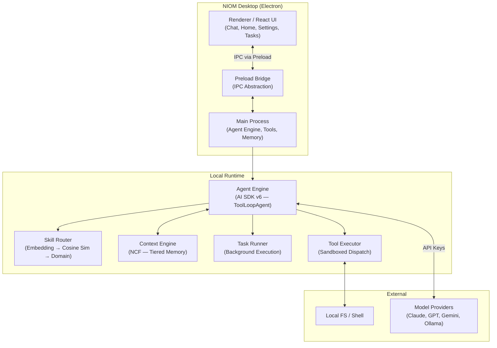
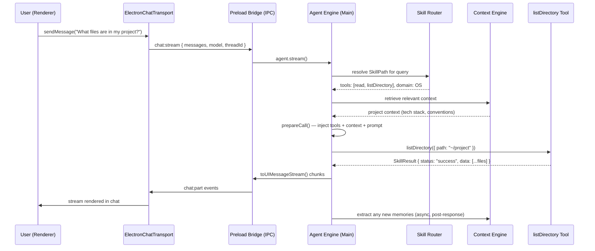

NIOM is a desktop application built on Electron that runs everything locally. There are no external services, no cloud infrastructure, and no accounts. The architecture is designed for a single user on a single machine.

## High-level diagram



## Two processes

| Process | Stack | Responsibilities |
|:--------|:------|:----------------|
| **Main** | Node.js 22, AI SDK v6 | Agent engine, tool execution, memory, Skill Tree, task orchestration, OS integration (tray, hotkey, notifications) |
| **Renderer** | React 19, Tailwind v4, shadcn/ui | Chat UI, thread management, settings, task panel, context graph visualization |

Communication between them happens over **Electron IPC** via a typed preload bridge (`window.niom`).

## Core components

### Agent Engine

The brain of NIOM. Uses AI SDK v6's `ToolLoopAgent` — not raw `streamText`. The agent:

1. Receives a user message
2. Calls `prepareCall` to route via the Skill Tree and inject context
3. Executes a tool loop (up to N steps with `stopWhen: stepCountIs(N)`)
4. Streams results to the renderer via `toUIMessageStream()`

### Skill Router

A hierarchical DAG that selects the right tools for each query in ~2ms. See [Skill Tree Architecture](/architecture/skill-tree) for the deep dive.

### Context Engine (NCF)

The NIOM Context Filesystem — a tiered memory system inspired by OpenViking. See [Context Engine Architecture](/architecture/context-engine) for details.

### Task Runner

A state machine that coordinates multi-phase background work. See [Task System Architecture](/architecture/task-system) for the full breakdown.

### Tool Executor

Sandboxed tool dispatch with a trust-based approval system. Tools return structured `SkillResult<T>` envelopes that enable agent self-correction.

## Data flow — a chat message

Here's what happens when you type "What files are in my project?" and press Enter:



## Tech stack

| Layer | Technology | Why |
|:------|:----------|:----|
| Desktop | Electron 34 + Electron Forge | OS integration — tray, hotkeys, frameless windows |
| Frontend | React 19, Tailwind v4, shadcn/ui | Modern component system, dark/light themes |
| AI | Vercel AI SDK v6 | Multi-provider, streaming, tool calling, model-agnostic |
| Embeddings | `@huggingface/transformers` (ONNX) | On-device `all-MiniLM-L6-v2`, ~5ms per query |
| Context | JSON files + tiered loading | No external DB, portable, inspectable |
| Tasks | JSON file queue + checkpoints | Crash-safe, resumable |
| Visualization | React Flow | Interactive context graph and Skill Tree viewer |

## Package boundaries

```
src/
├── main/                    # Electron main process (Node.js)
│   ├── agent.ts             # ToolLoopAgent factory
│   ├── ipc/                 # IPC handlers — thin wrappers
│   ├── tools/               # AI SDK tool definitions
│   ├── services/            # Business logic (config, chat, threads)
│   ├── skills/              # Skill graph, embeddings, routing, edge learning
│   ├── context/             # NCF — memory, retrieval, sessions, projects
│   └── tasks/               # Task runner, store, digest
├── transport/               # ChatTransport (Electron IPC bridge)
├── hooks/                   # React hooks (useNiomChat, useTaskManager)
├── components/              # React UI components
│   └── views/               # Page-level views (Home, Chat, Settings)
├── shared/                  # Types shared between main + renderer
└── types/                   # TypeScript declarations
```
