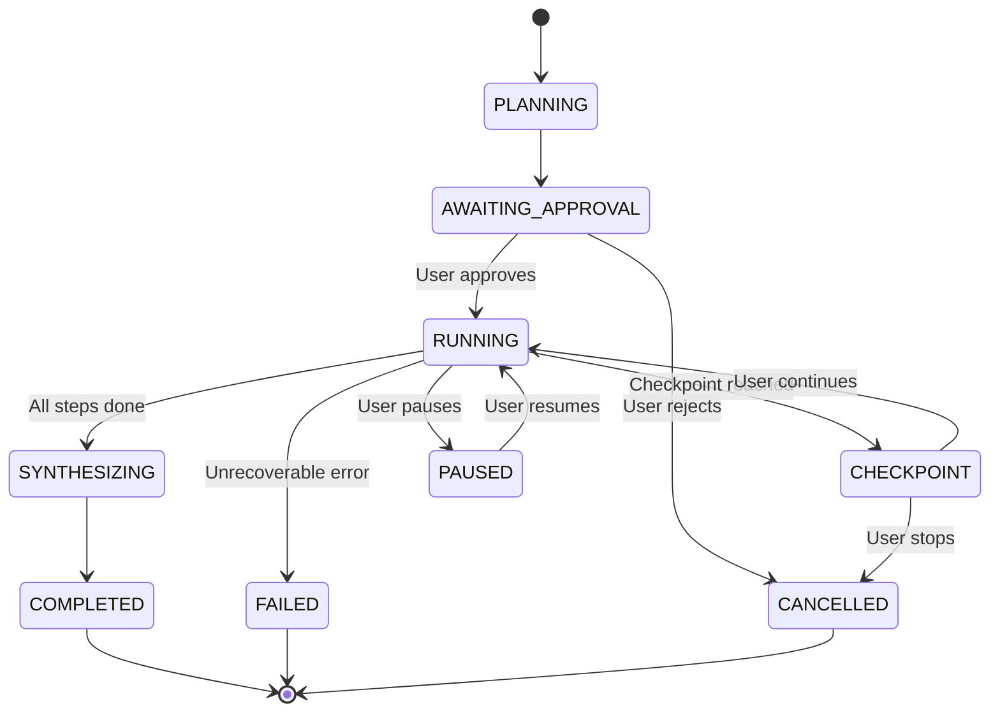

The Task System enables NIOM to execute complex, multi-step work autonomously in the background. It's not a custom agent framework — it's **sequential AI SDK v6 calls coordinated by plain TypeScript**.

## Mental model

```
Regular Chat:
  User message → 1 × ToolLoopAgent.stream() → Streamed response

Background Task:
  User goal → Plan (generateText) → N × Execute (agent.generate) → Synthesize (generateText)
```

## Architecture

### TaskRunner — the state machine

The `TaskRunner` is a state machine that coordinates the three phases:



### Three phases

#### Phase 1: Plan

A single `generateText` call decomposes the user's goal into concrete steps:

```typescript
const plan = await generateText({
  model,
  prompt: `Break this goal into 3-7 concrete steps: "${userGoal}"`,
  schema: z.object({
    steps: z.array(z.object({
      title: z.string(),
      description: z.string(),
      domain: z.string(),
    })),
  }),
});
```

The plan is shown to the user as a checkpoint. Nothing executes until approved.

#### Phase 2: Execute

Each step runs as a separate `ToolLoopAgent.generate()` call — not `.stream()`, since it's background work:

```typescript
for (const step of plan.steps) {
  const result = await agent.generate({
    prompt: step.description,
  });
  // Save intermediate results
  // Emit progress to renderer
}
```

Each step uses the same Skill Tree routing, tools, and trust layer as regular chat.

#### Phase 3: Synthesize

Another `generateText` call that takes all step results and produces the final deliverable:

```typescript
const deliverable = await generateText({
  model,
  prompt: `Given these findings, synthesize a final report...`,
});
```

## Persistence

Tasks are crash-safe. State is saved to `~/.niom/tasks/` as JSON after every significant event:

```
~/.niom/tasks/
├── <task-id>.json           # Task metadata + current state
├── <task-id>/
│   ├── plan.json            # The approved plan
│   ├── step-1.json          # Step 1 results
│   ├── step-2.json          # Step 2 results
│   └── deliverable.json     # Final output
```

On app restart, the TaskRunner:
1. Loads all tasks from disk
2. Resumes `RUNNING` tasks from their last completed step
3. Re-emits status to the renderer

## IPC communication

Tasks communicate with the renderer via IPC events:

| Event | Payload | When |
|:------|:--------|:-----|
| `task:progress` | Step index, status, summary | After each step |
| `task:checkpoint` | Plan or question for user review | Waiting for user input |
| `task:complete` | Final deliverable | Task finished successfully |
| `task:error` | Error message, recovery options | Step or system failure |
| `task:activity` | Real-time tool calls within a step | During execution |

## Error handling tiers

| Tier | Scope | Strategy |
|:-----|:------|:---------|
| **Tool-level** | A single tool call fails | Agent self-correction (up to 3 retries) |
| **Step-level** | Entire step fails | Checkpoint: Retry / Skip / Stop |
| **System-level** | API error, rate limit | Exponential backoff, auto-pause if persistent |

## TaskDetector — auto-detection

The `TaskDetector` analyzes incoming messages for task signals:

- **Multi-domain scoring** — Query activates multiple Skill Tree domains
- **Temporal markers** — "over the next week", "every day", "later"
- **Complexity keywords** — "deeply", "comprehensive", "full analysis"
- **Multi-part goals** — Semicolons, numbered lists, "then" clauses

When detected, NIOM suggests converting to a background task via a toast notification. The user always has the choice to proceed as regular chat.

## Design decisions

| Decision | Rationale |
|:---------|:----------|
| `generateText` for plan/synthesis | Per architecture: "generateText for internal LLM calls" |
| `agent.generate()` for steps | Same as chat but non-streaming — we need the final result, not chunks |
| Promise-based checkpoints | Zero resource consumption while waiting for user input |
| JSON persistence | Simple, inspectable, portable — no database needed |
| Step-level granularity | Each step is independently retriable and skippable |
